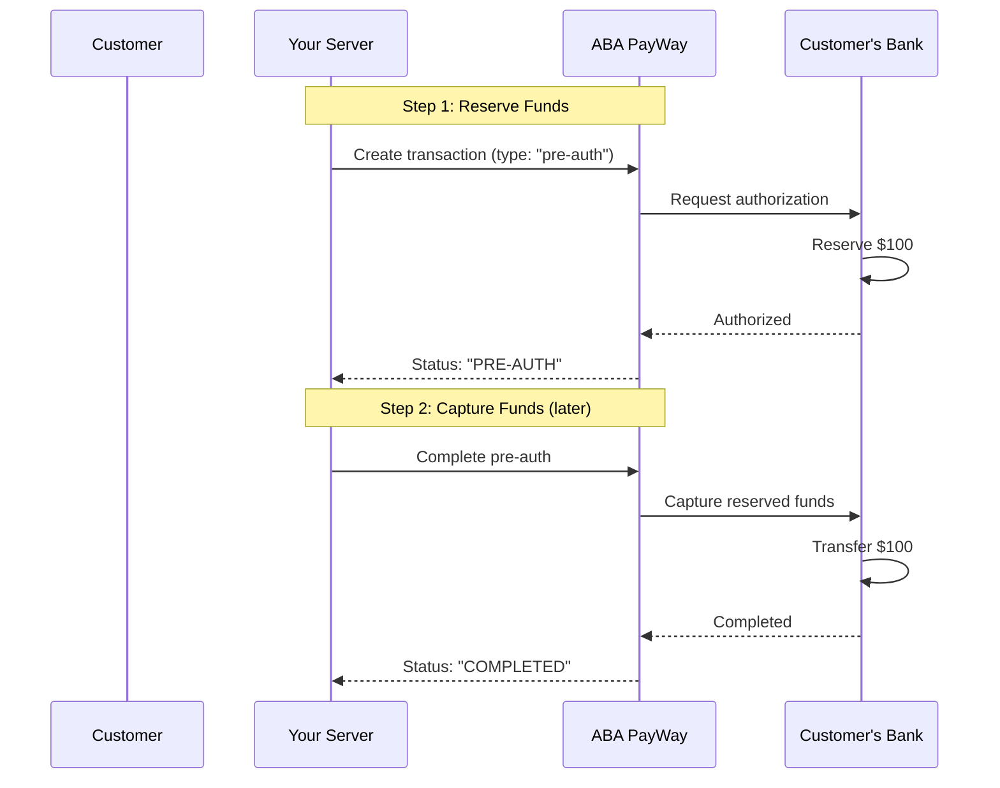

# payway-ts

> TypeScript SDK for ABA PayWay payment integration - Supports both client-side form submission and server-to-server API calls

[](https://www.npmjs.com/package/payway-ts)
[](LICENSE)

An unofficial, type-safe TypeScript SDK for ABA PayWay payment integration. This SDK provides two integration patterns:

1. **Payload Builder** - Build signed payloads for client-side form submission (recommended for `abapay`)
2. **Server-to-Server** - Execute API calls directly from your server (for other payment options)

> [!WARNING]  
> This is not a product of ABA Bank. This is an unofficial implementation based on https://www.payway.com.kh/developers/

## Credits

This package is built upon and inspired by the excellent work of **[Seanghay Yath](https://github.com/seanghay)** and the original [payway-js](https://github.com/seanghay/payway-js) package. We've extended it with:

- ✅ Full TypeScript support with comprehensive type definitions
- ✅ **Pre-Authorization transactions** (complete, cancel, with payout)
- ✅ **RSA encryption** for sensitive operations
- ✅ Dual integration patterns (payload builder + execute)
- ✅ Enhanced error handling with detailed API responses
- ✅ Extensive documentation and examples

Special thanks to the original contributors for laying the foundation!

## Two Integration Patterns

### Pattern 1: Client-Side Form Submission (for `abapay`)

Use this when you want the browser to submit directly to ABA PayWay:

```typescript
// Server builds payload → Client creates form → Browser submits to ABA
const payload = client.buildTransactionPayload({ payment_option: 'abapay', ... });
// Send payload to client, client creates and submits HTML form
```

**Use when:**
- Payment option is `abapay` (returns HTML checkout page)
- You want ABA to handle the full checkout UI
- Browser needs to redirect to ABA's payment page

### Pattern 2: Server-to-Server API Call

Use this when you want your server to communicate directly with ABA API:

```typescript
// Server builds and executes in one call
const result = await client.execute(
  client.buildTransactionPayload({ payment_option: 'cards', ... })
);
```

**Use when:**
- Payment option is NOT `abapay` (returns JSON)
- Checking transaction status
- Retrieving transaction lists
- You want to handle responses on the server

## Why Both Patterns?

Different payment flows require different approaches:

1. **`abapay`** - Returns HTML checkout page → Must use client-side form submission
2. **Other payment options** - Return JSON → Can use server-to-server API calls
3. **Flexibility** - Build payloads on server, choose how to execute (client form vs server API call)

## Features

### Core Features (from original payway-js)
- ✅ Create transactions
- ✅ Check transaction status  
- ✅ List transactions
- ✅ HMAC-SHA512 request signing

### New Features in payway-ts
- ✨ **Full TypeScript Support** - Complete type definitions with autocomplete
- ✨ **Pre-Authorization Transactions** - Complete, cancel, and payout support with RSA encryption
- ✨ **Dual Integration Modes** - Client-side form submission OR server-to-server API calls
- ✨ **Enhanced Error Handling** - Detailed API error responses with status codes and bodies
- ✨ **RSA Encryption** - Secure data encryption for sensitive operations (117-byte chunking)
- 🔒 **Server-Side Security** - Build payloads securely on your server (Node.js 18+)
- 🚀 **ES Modules** - Native ESM support
- 📦 **Minimal Dependencies** - Only `date-fns` for date formatting
- 🎯 **Next.js Ready** - Works seamlessly with Next.js API routes
- ⚡ **Smart Validation** - Prevents common mistakes (e.g., using `abapay` with server-to-server)

## Installation

```bash
npm install payway-ts
```

## Requirements

- Node.js 18.0.0 or higher
- ABA Bank merchant account with API credentials

## Quick Start

### Decision Tree: Which Pattern Should I Use?

```
Is payment_option = "abapay"?
├─ YES → Use Pattern 1 (Client-Side Form)
│         ↳ ABA returns HTML checkout page
│         ↳ Browser must submit form directly
│
└─ NO  → Use Pattern 2 (Server-to-Server)
          ↳ ABA returns JSON response
          ↳ Your server handles the API call
```

### Pattern 1: Client-Side Form Submission

**Best for:** `abapay` payment option

#### Flow Overview

```
1. Server (Next.js API) → Build signed payload using SDK
2. Server → Client → Send payload as JSON
3. Client (Browser) → Create hidden HTML form from payload
4. Client → ABA PayWay → Submit form directly to ABA
5. ABA → Client → ABA handles checkout and redirects back to your return_url
```

#### 1. Server-Side: Build Payload

```typescript
// app/api/payment/create/route.ts
import { PayWayClient } from 'payway-ts';

const client = new PayWayClient(
  'https://checkout-sandbox.payway.com.kh/',
  process.env.PAYWAY_MERCHANT_ID!,
  process.env.PAYWAY_API_KEY!
);

export async function POST(request: Request) {
  const { amount, orderId } = await request.json();
  
  // Build payload with hash signature
  const payload = client.buildTransactionPayload({
    tran_id: orderId,
    amount: amount,
    currency: 'USD',
    payment_option: 'abapay',
    return_url: 'https://yoursite.com/payment/callback',
    view_type: 'popup'  // Optional: 'popup' or 'hosted_view'
  });
  
  // Send to client
  return Response.json(payload);
}
```

### 2. Client-Side: Create and Submit Form

```typescript
'use client';

export default function PaymentButton() {
  const handlePayment = async () => {
    // Get signed payload from your server
    const payload = await fetch('/api/payment/create', {
      method: 'POST',
      body: JSON.stringify({ 
        amount: 100, 
        orderId: `ORDER-${Date.now()}` 
      })
    }).then(r => r.json());
    
    // Create hidden form
    const form = document.createElement('form');
    form.method = payload.method; // "POST"
    form.action = payload.url;     // ABA PayWay URL
    
    // Add all fields as hidden inputs
    for (const [key, value] of Object.entries(payload.fields)) {
      const input = document.createElement('input');
      input.type = 'hidden';
      input.name = key;
      input.value = String(value);
      form.appendChild(input);
    }
    
    // Submit to ABA PayWay
    document.body.appendChild(form);
    form.submit();
  };
  
  return (
    <button onClick={handlePayment}>
      Pay with ABA
    </button>
  );
}
```

### Pattern 2: Server-to-Server API Call

**Best for:** All payment options except `abapay`, transaction checks, and transaction lists

#### Simple Example

```typescript
// app/api/payment/process/route.ts
import { PayWayClient } from 'payway-ts';

const client = new PayWayClient(
  'https://checkout-sandbox.payway.com.kh/',
  process.env.PAYWAY_MERCHANT_ID!,
  process.env.PAYWAY_API_KEY!
);

export async function POST(request: Request) {
  const { amount, orderId } = await request.json();
  
  try {
    // Build and execute in one step
    const result = await client.execute(
      client.buildTransactionPayload({
        tran_id: orderId,
        amount: amount,
        currency: 'USD',
        payment_option: 'cards',  // NOT 'abapay'
        return_url: 'https://yoursite.com/callback'
      })
    );
    
    return Response.json(result);
  } catch (error) {
    return Response.json({ error: error.message }, { status: 500 });
  }
}
```

#### Check Transaction Status

```typescript
// Check a transaction
const status = await client.execute(
  client.buildCheckTransactionPayload('ORDER-123')
);

console.log('Transaction status:', status);
```

#### List Transactions

```typescript
// Get transaction list
const transactions = await client.execute(
  client.buildTransactionListPayload({
    from_date: '20240101000000',
    to_date: '20240131235959',
    status: 'APPROVED'
  })
);

console.log('Transactions:', transactions);
```

### Pre-Authorization Transactions

Pre-authorization is a **two-step payment process** that allows you to reserve funds first, then capture them later.

#### How Pre-Auth Works



**Common Use Cases:**
- 🏨 **Hotels** - Reserve on booking, charge at checkout
- 🚗 **Car Rentals** - Reserve deposit, charge final amount with extras
- 🍽️ **Restaurants** - Reserve amount, add tip later
- 🛒 **Marketplaces** - Verify funds, capture after fulfillment

#### Security: RSA Encryption Required

Pre-auth operations require **ABA Bank's RSA public key** for encryption:

```typescript
const client = new PayWayClient(
  process.env.PAYWAY_BASE_URL!,
  process.env.PAYWAY_MERCHANT_ID!,
  process.env.PAYWAY_API_KEY!,
  process.env.ABA_RSA_PUBLIC_KEY!  // Required for pre-auth
);
```

**Two-Layer Security:**
1. **RSA Encryption** - Sensitive data encrypted with ABA's public key (only ABA can decrypt)
2. **HMAC Signing** - Request integrity verified with your API key

#### Step 1: Create Pre-Auth Transaction

```typescript
// Create a pre-authorization (reserve funds)
const payload = client.buildTransactionPayload({
  tran_id: 'ORDER-123',
  amount: 100,
  currency: 'USD',
  payment_option: 'cards',
  type: 'pre-auth',  // Important: Set type to pre-auth
  return_url: 'https://yoursite.com/callback'
});

const result = await client.execute(payload);
// Result: { transaction_status: "PRE-AUTH", ... }
```

#### Step 2a: Complete Pre-Auth (Capture Funds)

```typescript
// Complete with the authorized amount
const result = await client.execute(
  client.buildCompletePreAuthPayload({
    tran_id: 'ORDER-123',
    complete_amount: 100  // Required: the amount to capture
  })
);

console.log(result.transaction_status); // "COMPLETED"
console.log(result.grand_total);        // 100

// Complete with increased amount (+10% allowed for card payments)
const result = await client.execute(
  client.buildCompletePreAuthPayload({
    tran_id: 'ORDER-123',
    complete_amount: 110  // Original was 100, can add up to 10%
  })
);
```

#### Step 2b: Complete Pre-Auth with Payout

For marketplace scenarios where funds need to be split:

```typescript
const result = await client.execute(
  client.buildCompletePreAuthWithPayoutPayload({
    tran_id: 'ORDER-123',
    complete_amount: 100,
    payout: JSON.stringify({
      beneficiaries: [
        { account: '123456', amount: 80 },  // Vendor gets 80%
        { account: '789012', amount: 20 }   // Platform fee 20%
      ]
    })
  })
);
```

#### Step 2c: Cancel Pre-Auth (Release Funds)

If the transaction won't proceed, release the reserved funds:

```typescript
const result = await client.execute(
  client.buildCancelPreAuthPayload({
    tran_id: 'ORDER-123'
  })
);

console.log(result.transaction_status); // "CANCELLED"
```

#### Pre-Auth Rules & Limitations

| Rule | Description |
|------|-------------|
| ✅ **One-time completion** | Can only complete pre-auth once |
| ⏰ **Expiration** | Pre-auth expires after a certain period |
| 💳 **+10% for cards** | Card payments can complete with up to 10% more |
| ❌ **No double completion** | Cannot complete already completed/cancelled pre-auth |

#### Multi-Merchant System Example

If you're building a system where multiple merchants can configure their own payment methods:

```typescript
// Database schema example
interface PaymentMethod {
  id: string;
  merchant_id: string;              // ABA merchant ID (plain text)
  api_key: string;                  // ENCRYPT with AES-256 in database
  aba_rsa_public_key: string;       // ABA's public key (plain text OK)
  base_url: string;                 // Sandbox or production URL
  created_by_admin_id: string;
}

// Fetch merchant credentials from database
async function processPreAuthCompletion(merchantId: string, tranId: string) {
  // Get credentials from database
  const credentials = await db.getPaymentMethod(merchantId);
  
  // Initialize client with merchant's keys
  const client = new PayWayClient(
    credentials.base_url,
    credentials.merchant_id,
    decrypt(credentials.api_key),       // Decrypt API key from database
    credentials.aba_rsa_public_key      // Public key - no decryption needed
  );
  
  // Complete the pre-auth
  const result = await client.execute(
    client.buildCompletePreAuthPayload({ tran_id: tranId })
  );
  
  return result;
}
```

**Security Best Practices for Database Storage:**

| Credential | Storage Method | Reason |
|------------|----------------|--------|
| `merchant_id` | Plain text | Not sensitive |
| `api_key` | **Encrypt with AES-256** | Secret key, must be protected |
| `aba_rsa_public_key` | Plain text | It's a public key by design |
| `base_url` | Plain text | Not sensitive |

```typescript
// Example: Storing credentials securely
import { encrypt, decrypt } from './crypto'; // Your encryption utility

async function savePaymentMethod(data: {
  merchant_id: string;
  api_key: string;
  aba_rsa_public_key: string;
}) {
  await db.insert('payment_methods', {
    merchant_id: data.merchant_id,
    api_key: encrypt(data.api_key),           // Encrypt before storing
    aba_rsa_public_key: data.aba_rsa_public_key, // Store as-is
    base_url: process.env.PAYWAY_BASE_URL
  });
}
```

#### Error Handling

The SDK now provides detailed error information including HTTP status codes and response bodies from ABA PayWay:

```typescript
import type { PayWayAPIError } from 'payway-ts';

try {
  const result = await client.execute(
    client.buildCompletePreAuthPayload({
      tran_id: 'ORDER-123',
      complete_amount: 100
    })
  );
  
  if (result.status.code === '00') {
    console.log('✅ Pre-auth completed successfully');
  }
} catch (error: any) {
  // Check if it's an API error with detailed information
  if (error.status) {
    console.error('❌ PayWay API Error');
    console.error('Status:', error.status, error.statusText);
    console.error('Response:', error.body);
    
    // Handle specific error codes
    if (error.status === 403) {
      console.error('Access forbidden - check credentials or merchant permissions');
    } else if (error.status === 400) {
      console.error('Bad request - check payload parameters');
    } else if (error.status === 500) {
      console.error('Server error - try again later');
    }
  } else if (error.message.includes('RSA public key is required')) {
    console.error('❌ Missing RSA public key - check client initialization');
  } else {
    console.error('❌ Unexpected error:', error.message);
  }
}
```

**Error Object Structure:**

When an API call fails, the error object contains:

```typescript
{
  message: string;        // Error message
  status: number;         // HTTP status code (403, 400, 500, etc.)
  statusText: string;     // HTTP status text ("Forbidden", etc.)
  body: any;              // Response body from ABA PayWay (JSON or text)
}
```

#### Why Not `abapay`?

The `execute()` method will throw an error if you try to use it with `payment_option: 'abapay'`:

```typescript
// ❌ This will throw an error
await client.execute(
  client.buildTransactionPayload({
    payment_option: 'abapay',  // Error!
    // ...
  })
);
// Error: Cannot execute transactions with payment_option "abapay" from server.
// The "abapay" option returns HTML and must be submitted via client-side form.

// ✅ Use client-side form submission instead (Pattern 1)
```

**Why?** Because `abapay` returns an HTML checkout page, not JSON. Your browser needs to render this page and handle the payment flow.

**Special case:** If you really need to handle HTML responses on the server (advanced use case), you can override this:

```typescript
const htmlResponse = await client.execute(
  client.buildTransactionPayload({ payment_option: 'abapay', ... }),
  { allowHtml: true }  // ⚠️ Advanced: returns HTML string
);
```

## API Reference

### PayWayClient

```typescript
const client = new PayWayClient(
  base_url: string,      // e.g., 'https://checkout-sandbox.payway.com.kh/'
  merchant_id: string,   // Your merchant ID
  api_key: string        // Your API key
)
```

### Methods

#### Overview

| Method | Purpose | Returns | Use Case |
|--------|---------|---------|----------|
| `buildTransactionPayload()` | Build payment payload | `PayloadBuilderResponse` | Create payments |
| `buildCheckTransactionPayload()` | Build status check payload | `PayloadBuilderResponse` | Check status |
| `buildTransactionListPayload()` | Build transaction list payload | `PayloadBuilderResponse` | List transactions |
| `buildCompletePreAuthPayload()` | Build complete pre-auth payload | `PayloadBuilderResponse` | Capture pre-auth funds |
| `buildCompletePreAuthWithPayoutPayload()` | Build complete pre-auth with payout | `PayloadBuilderResponse` | Capture & distribute funds |
| `buildCancelPreAuthPayload()` | Build cancel pre-auth payload | `PayloadBuilderResponse` | Release pre-auth funds |
| `execute()` | Execute a payload (server-to-server) | `Promise<any>` | Server API calls |
| `create_hash()` | Generate HMAC-SHA512 hash | `string` | Manual signing |

---

#### 1. buildTransactionPayload()

Build a payment transaction payload for client-side form submission.

```typescript
const payload = client.buildTransactionPayload({
  tran_id: "ORDER-123",
  amount: 100,
  currency: "USD",
  payment_option: "abapay",
  return_url: "https://yoursite.com/callback",
  firstname: "John",
  lastname: "Doe",
  email: "john@example.com",
  phone: "+855123456789"
});

// Returns:
{
  fields: {
    req_time: "20241214223000",
    merchant_id: "your_merchant_id",
    tran_id: "ORDER-123",
    amount: "100",
    currency: "USD",
    payment_option: "abapay",
    return_url: "aHR0cHM6Ly...",  // base64 encoded
    firstname: "John",
    lastname: "Doe",
    email: "john@example.com",
    phone: "+855123456789",
    hash: "abc123..."              // HMAC-SHA512 signature
  },
  hash: "abc123...",               // Same hash for reference
  url: "https://checkout-sandbox.payway.com.kh/api/payment-gateway/v1/payments/purchase",
  method: "POST"
}
```

**Parameters:**

| Parameter | Type | Required | Description |
|-----------|------|----------|-------------|
| `tran_id` | string | Recommended | Unique transaction ID |
| `amount` | number \| string | Yes | Transaction amount |
| `currency` | "USD" \| "KHR" | No | Currency code (default: USD) |
| `payment_option` | PaymentOption | No | Payment method (see below) |
| `return_url` | string | Recommended | URL to redirect after payment (auto base64 encoded) |
| `return_deeplink` | string \| object | No | Mobile app deeplink (auto base64 encoded) |
| `continue_success_url` | string | No | Success continuation URL |
| `firstname` | string | No | Customer first name |
| `lastname` | string | No | Customer last name |
| `email` | string | No | Customer email |
| `phone` | string | No | Customer phone number |
| `pwt` | string | No | PayWay token |
| `view_type` | ViewType | No | Payment page view type: `"hosted_view"` (new tab) or `"popup"` (modal/bottom sheet). **Note:** Not included in hash signature |

**Payment Options:**

- `cards` - Card payments
- `abapay` - ABA PAY
- `abapay_deeplink` - ABA PAY deeplink
- `abapay_khqr_deeplink` - ABA PAY and KHQR deeplink
- `wechat` - WeChat Wallet
- `alipay` - Alipay Wallet
- `bakong` - Bakong

**View Types:**

The `view_type` parameter controls how the payment page is displayed:

- `"hosted_view"` - Redirects payer to a new tab/window (default behavior)
- `"popup"` - Displays as a modal popup on desktop browsers and bottom sheet on mobile web browsers

**Important:** The `view_type` field is included in form fields but is **NOT included in the hash signature**. This is by design according to ABA PayWay specifications.

**Example with view_type:**

```typescript
const payload = client.buildTransactionPayload({
  payment_option: 'abapay',
  amount: 100,
  tran_id: 'ORDER-123',
  view_type: 'popup'  // Show as popup instead of redirect
});
```

---

#### 2. buildCheckTransactionPayload()

Build a payload to check transaction status.

```typescript
const payload = client.buildCheckTransactionPayload("ORDER-123");

// Pattern 1: Manual server-to-server request
const formData = new FormData();
for (const [key, value] of Object.entries(payload.fields)) {
  formData.append(key, value);
}

const response = await fetch(payload.url, {
  method: payload.method,
  body: formData
});

const result = await response.json();

// Pattern 2: Use execute() method (recommended)
const result = await client.execute(payload);
```

---

#### 3. buildTransactionListPayload()

Build a payload to retrieve transaction list.

```typescript
const payload = client.buildTransactionListPayload({
  from_date: "20240101000000",
  to_date: "20240131235959",
  status: "APPROVED"
});

// Pattern 1: Manual server-to-server request
const formData = new FormData();
for (const [key, value] of Object.entries(payload.fields)) {
  formData.append(key, value);
}

const response = await fetch(payload.url, {
  method: payload.method,
  body: formData
});

const transactions = await response.json();

// Pattern 2: Use execute() method (recommended)
const transactions = await client.execute(payload);
```

**Parameters:**

| Parameter | Type | Required | Description |
|-----------|------|----------|-------------|
| `from_date` | string | No | Start date (yyyyMMddHHmmss) |
| `to_date` | string | No | End date (yyyyMMddHHmmss) |
| `from_amount` | number \| string | No | Minimum amount |
| `to_amount` | number \| string | No | Maximum amount |
| `status` | TransactionStatus | No | Transaction status filter |

---

#### 4. buildCompletePreAuthPayload()

Build a payload to complete (capture) a pre-authorized transaction.

```typescript
const payload = client.buildCompletePreAuthPayload({
  tran_id: "ORDER-123",
  complete_amount: 110  // Required: amount to capture
});

// Execute the completion
const result = await client.execute(payload);
```

**Parameters:**

| Parameter | Type | Required | Description |
|-----------|------|----------|-------------|
| `tran_id` | string | Yes | Transaction ID of the pre-auth |
| `complete_amount` | number \| string | Yes | Amount to capture. Cards: can be up to +10% of original |

**Requirements:**
- RSA public key must be provided in constructor
- Pre-auth must be in valid state (not expired/completed/cancelled)
- Can only complete once

**Returns:** `PayloadBuilderResponse`

---

#### 5. buildCompletePreAuthWithPayoutPayload()

Build a payload to complete a pre-auth and distribute funds to multiple beneficiaries.

```typescript
const payload = client.buildCompletePreAuthWithPayoutPayload({
  tran_id: "ORDER-123",
  complete_amount: 100,
  payout: JSON.stringify({
    beneficiaries: [
      { account: "123456", amount: 80 },
      { account: "789012", amount: 20 }
    ]
  })
});

const result = await client.execute(payload);
```

**Parameters:**

| Parameter | Type | Required | Description |
|-----------|------|----------|-------------|
| `tran_id` | string | Yes | Transaction ID of the pre-auth |
| `complete_amount` | number \| string | Yes | Amount to capture |
| `payout` | string | Yes | JSON string with payout details |

**Payout Format:**
The `payout` parameter should be a JSON string containing beneficiary information. Contact ABA Bank for the exact schema.

**Requirements:**
- RSA public key must be provided in constructor
- Pre-auth must be in valid state

**Returns:** `PayloadBuilderResponse`

---

#### 6. buildCancelPreAuthPayload()

Build a payload to cancel a pre-authorized transaction and release reserved funds.

```typescript
const payload = client.buildCancelPreAuthPayload({
  tran_id: "ORDER-123"
});

const result = await client.execute(payload);
console.log(result.transaction_status); // "CANCELLED"
```

**Parameters:**

| Parameter | Type | Required | Description |
|-----------|------|----------|-------------|
| `tran_id` | string | Yes | Transaction ID of the pre-auth to cancel |

**Requirements:**
- RSA public key must be provided in constructor
- Pre-auth must be in valid state (not expired/already cancelled/completed)

**Returns:** `PayloadBuilderResponse`

---

#### 7. execute()

Execute a payload with server-to-server HTTP request. This method makes the actual API call to ABA PayWay.

```typescript
async execute(
  payload: PayloadBuilderResponse,
  options?: ExecuteOptions
): Promise<any>
```

**Parameters:**

| Parameter | Type | Required | Description |
|-----------|------|----------|-------------|
| `payload` | `PayloadBuilderResponse` | Yes | Payload from build methods |
| `options` | `ExecuteOptions` | No | Execution options |

**ExecuteOptions:**

| Option | Type | Default | Description |
|--------|------|---------|-------------|
| `allowHtml` | boolean | `false` | Allow HTML responses (for advanced use) |

**Returns:** `Promise<any>` - The JSON response from ABA PayWay API

**Throws:**
- Error if `payment_option === "abapay"` without `allowHtml: true`
- Error if response is HTML without `allowHtml: true`
- Error if HTTP request fails

**Examples:**

```typescript
// Create a payment (NOT abapay)
const result = await client.execute(
  client.buildTransactionPayload({
    payment_option: 'cards',
    amount: 100,
    tran_id: 'ORDER-123'
  })
);

// Check transaction status
const status = await client.execute(
  client.buildCheckTransactionPayload('ORDER-123')
);

// List transactions
const transactions = await client.execute(
  client.buildTransactionListPayload({ status: 'APPROVED' })
);

// Advanced: Allow HTML response (not recommended)
const html = await client.execute(
  client.buildTransactionPayload({ payment_option: 'abapay', ... }),
  { allowHtml: true }
);
```

**⚠️ Important:**
- Use this method for server-to-server API calls only
- Do NOT use with `payment_option: 'abapay'` unless you specifically need to handle HTML
- For `abapay`, use Pattern 1 (client-side form submission) instead

---

#### 8. create_hash()

Utility method to create HMAC-SHA512 hash (used internally).

```typescript
const hash = client.create_hash(['value1', 'value2', 'value3']);
// Returns: base64 encoded HMAC-SHA512 hash
```

## Complete Examples

### Next.js App Router

```typescript
// ==============================================
// app/api/payment/create/route.ts
// ==============================================
import { PayWayClient } from 'payway-ts';

const client = new PayWayClient(
  process.env.PAYWAY_BASE_URL!,
  process.env.PAYWAY_MERCHANT_ID!,
  process.env.PAYWAY_API_KEY!
);

export async function POST(request: Request) {
  try {
    const { amount, orderId, customerEmail } = await request.json();
    
    const payload = client.buildTransactionPayload({
      tran_id: orderId,
      amount,
      currency: 'USD',
      payment_option: 'abapay',
      email: customerEmail,
      return_url: `${process.env.NEXT_PUBLIC_APP_URL}/payment/callback`
    });
    
    return Response.json(payload);
  } catch (error) {
    return Response.json(
      { error: 'Failed to create payment' },
      { status: 500 }
    );
  }
}

// ==============================================
// app/components/PaymentForm.tsx
// ==============================================
'use client';

import { useState } from 'react';

export default function PaymentForm() {
  const [loading, setLoading] = useState(false);
  
  const handleSubmit = async (e: React.FormEvent) => {
    e.preventDefault();
    setLoading(true);
    
    try {
      // Get payload from server
      const payload = await fetch('/api/payment/create', {
        method: 'POST',
        headers: { 'Content-Type': 'application/json' },
        body: JSON.stringify({
          amount: 100,
          orderId: `ORDER-${Date.now()}`,
          customerEmail: 'customer@example.com'
        })
      }).then(r => r.json());
      
      // Create and submit form
      const form = document.createElement('form');
      form.method = payload.method;
      form.action = payload.url;
      
      Object.entries(payload.fields).forEach(([key, value]) => {
        const input = document.createElement('input');
        input.type = 'hidden';
        input.name = key;
        input.value = String(value);
        form.appendChild(input);
      });
      
      document.body.appendChild(form);
      form.submit();
    } catch (error) {
      console.error('Payment failed:', error);
      setLoading(false);
    }
  };
  
  return (
    <form onSubmit={handleSubmit}>
      <button type="submit" disabled={loading}>
        {loading ? 'Processing...' : 'Pay $100'}
      </button>
    </form>
  );
}
```

### Next.js Pages Router

```typescript
// ==============================================
// pages/api/payment/create.ts
// ==============================================
import { PayWayClient } from 'payway-ts';
import type { NextApiRequest, NextApiResponse } from 'next';

const client = new PayWayClient(
  process.env.PAYWAY_BASE_URL!,
  process.env.PAYWAY_MERCHANT_ID!,
  process.env.PAYWAY_API_KEY!
);

export default async function handler(
  req: NextApiRequest,
  res: NextApiResponse
) {
  if (req.method !== 'POST') {
    return res.status(405).json({ error: 'Method not allowed' });
  }

  try {
    const { amount, orderId } = req.body;
    
    const payload = client.buildTransactionPayload({
      tran_id: orderId,
      amount,
      currency: 'USD',
      payment_option: 'abapay',
      return_url: `${process.env.NEXT_PUBLIC_APP_URL}/payment/callback`
    });
    
    res.status(200).json(payload);
  } catch (error) {
    res.status(500).json({ error: 'Failed to create payment' });
  }
}
```

### Server-to-Server Examples

#### Check Transaction Status

```typescript
// app/api/payment/status/[tranId]/route.ts
import { PayWayClient } from 'payway-ts';

const client = new PayWayClient(
  process.env.PAYWAY_BASE_URL!,
  process.env.PAYWAY_MERCHANT_ID!,
  process.env.PAYWAY_API_KEY!
);

export async function GET(
  request: Request,
  { params }: { params: { tranId: string } }
) {
  try {
    const status = await client.execute(
      client.buildCheckTransactionPayload(params.tranId)
    );
    
    return Response.json(status);
  } catch (error) {
    return Response.json({ error: error.message }, { status: 500 });
  }
}
```

#### List Transactions

```typescript
// app/api/payment/list/route.ts
import { PayWayClient } from 'payway-ts';

const client = new PayWayClient(
  process.env.PAYWAY_BASE_URL!,
  process.env.PAYWAY_MERCHANT_ID!,
  process.env.PAYWAY_API_KEY!
);

export async function GET(request: Request) {
  const { searchParams } = new URL(request.url);
  const status = searchParams.get('status');
  
  try {
    const transactions = await client.execute(
      client.buildTransactionListPayload({
        status: status as any,
        from_date: '20240101000000',
        to_date: '20241231235959'
      })
    );
    
    return Response.json(transactions);
  } catch (error) {
    return Response.json({ error: error.message }, { status: 500 });
  }
}
```

#### Process Card Payment (Server-to-Server)

```typescript
// app/api/payment/card/route.ts
import { PayWayClient } from 'payway-ts';

const client = new PayWayClient(
  process.env.PAYWAY_BASE_URL!,
  process.env.PAYWAY_MERCHANT_ID!,
  process.env.PAYWAY_API_KEY!
);

export async function POST(request: Request) {
  const { amount, orderId, customerEmail } = await request.json();
  
  try {
    // Server-to-server for card payments
    const result = await client.execute(
      client.buildTransactionPayload({
        tran_id: orderId,
        amount,
        currency: 'USD',
        payment_option: 'cards',  // NOT abapay
        email: customerEmail,
        return_url: `${process.env.NEXT_PUBLIC_APP_URL}/payment/callback`
      })
    );
    
    return Response.json(result);
  } catch (error) {
    return Response.json({ error: error.message }, { status: 500 });
  }
}
```

## Environment Variables

Create a `.env.local` file:

```env
# Sandbox
PAYWAY_BASE_URL=https://checkout-sandbox.payway.com.kh/
PAYWAY_MERCHANT_ID=your_sandbox_merchant_id
PAYWAY_API_KEY=your_sandbox_api_key

# Production
# PAYWAY_BASE_URL=https://checkout.payway.com.kh/
# PAYWAY_MERCHANT_ID=your_production_merchant_id
# PAYWAY_API_KEY=your_production_api_key

NEXT_PUBLIC_APP_URL=https://yoursite.com
```

## TypeScript Support

All methods are fully typed:

```typescript
import type { 
  PayWayClient,
  CreateTransactionParams,
  PayloadBuilderResponse,
  TransactionStatus,
  PaymentOption,
  ExecuteOptions,
  CompletePreAuthParams,           // Pre-auth types
  CompletePreAuthWithPayoutParams,
  CancelPreAuthParams,
  PreAuthResponse,
  PayWayAPIError                   // Error type
} from 'payway-ts';

const params: CreateTransactionParams = {
  amount: 100,
  tran_id: 'ORDER-123',
  currency: 'USD',
  payment_option: 'abapay',
  type: 'pre-auth'  // For pre-authorization
};

const payload: PayloadBuilderResponse = client.buildTransactionPayload(params);

// TypeScript knows the structure
payload.fields.hash;   // ✓ string
payload.url;           // ✓ string
payload.method;        // ✓ "POST"

// Pre-auth operations with full type safety
const preAuthParams: CompletePreAuthParams = {
  tran_id: 'ORDER-123',
  complete_amount: 110
};

const preAuthResult: PreAuthResponse = await client.execute(
  client.buildCompletePreAuthPayload(preAuthParams)
);

preAuthResult.transaction_status;  // ✓ "COMPLETED" | "CANCELLED" | string
preAuthResult.grand_total;         // ✓ number | undefined
```

## Utility Functions

### trim()

Utility function to trim strings, passes through other types.

```typescript
import { trim } from 'payway-ts';

trim("  hello  ");  // "hello"
trim(null);          // null
trim(undefined);     // undefined
```

## How It Works

### 1. Hash Generation

The SDK uses HMAC-SHA512 to sign requests:

```typescript
// Hash is created from: req_time + merchant_id + all field values (in order)
const hashInput = [
  req_time,        // "20241214223000"
  merchant_id,     // "your_merchant_id"
  ...fieldValues   // All other field values in the order they were added
];

const hash = HMAC_SHA512(hashInput.join(''), api_key);
```

### 2. Base64 Encoding

The SDK automatically base64 encodes:
- `return_url` - Your callback URL
- `return_deeplink` - Mobile app deeplinks

This is required by ABA PayWay API.

### 3. Field Ordering

While the hash generation cares about order, the returned `fields` object can be iterated in any order for form creation (browsers don't guarantee form field order anyway).

## Security

- **Never expose your API key** - Always use environment variables
- **Server-side only** - Build payloads on your server, never in the browser
- **HMAC signing** - All payloads are automatically signed with HMAC-SHA512
- **HTTPS only** - Always use HTTPS in production
- **Validate callbacks** - Always verify transaction status on your server after payment (don't trust client-side data)

## Common Pitfalls

### ❌ Using `abapay` with `execute()`

```typescript
// DON'T DO THIS
await client.execute(
  client.buildTransactionPayload({ payment_option: 'abapay', ... })
);
// Error: Cannot execute transactions with payment_option "abapay" from server
```

**Why?** `abapay` returns HTML, not JSON. Use client-side form submission instead.

### ❌ Making HTTP requests from the browser

```typescript
// DON'T DO THIS (in browser)
const client = new PayWayClient(url, merchantId, apiKey); // Exposes API key!
```

**Why?** Your API key would be exposed. Always build payloads on the server.

### ✅ Correct Pattern

```typescript
// Server: Build payload
const payload = client.buildTransactionPayload({ ... });
return Response.json(payload);

// Client: Create form and submit
const form = document.createElement('form');
// ... add fields from payload
form.submit();
```

## Testing

```bash
npm test
npm run test:coverage
```

## Building

```bash
npm run build
npm run typecheck
```

## License

MIT License - see [LICENSE](LICENSE) file for details

## Disclaimer

This is an **unofficial** SDK and is not affiliated with or endorsed by ABA Bank. Use at your own risk.

For ABA PayWay API documentation and support, please contact ABA Bank directly or visit https://www.payway.com.kh/developers/

## Author

**tykealy**

## Links

- [npm package](https://www.npmjs.com/package/payway-ts)
- [GitHub repository](https://github.com/tykealy/payway-ts)
- [Original payway-js package](https://github.com/seanghay/payway-js) by Seanghay Yath
- [ABA Bank](https://www.ababank.com/)
- [PayWay Developer Docs](https://www.payway.com.kh/developers/)
